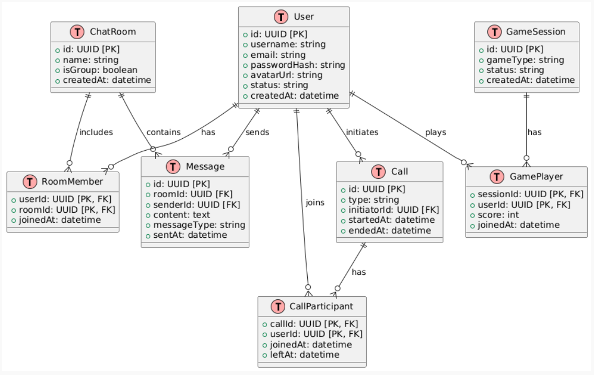
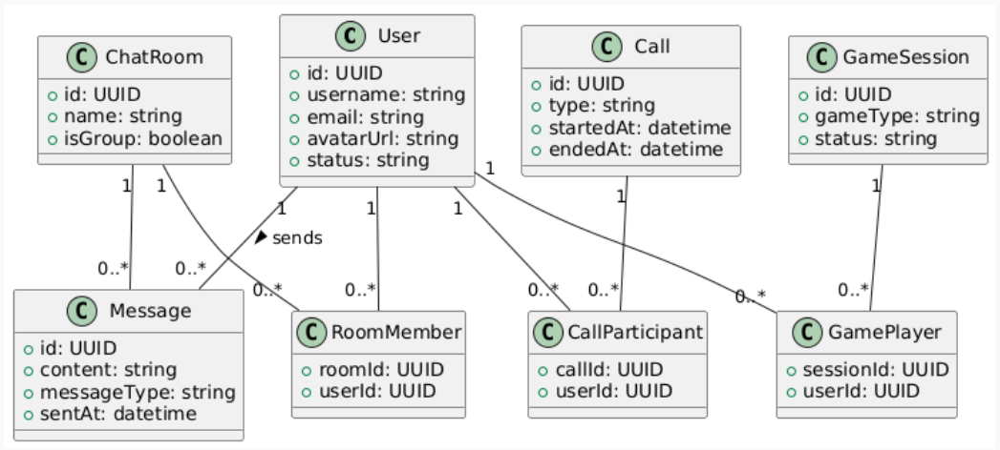
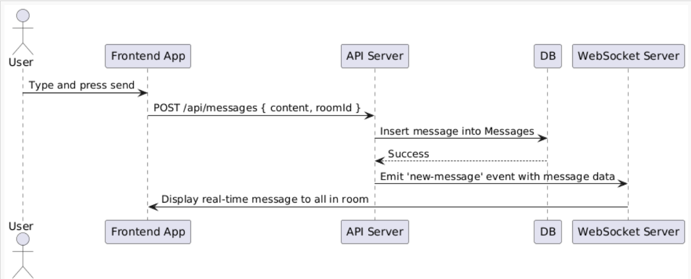
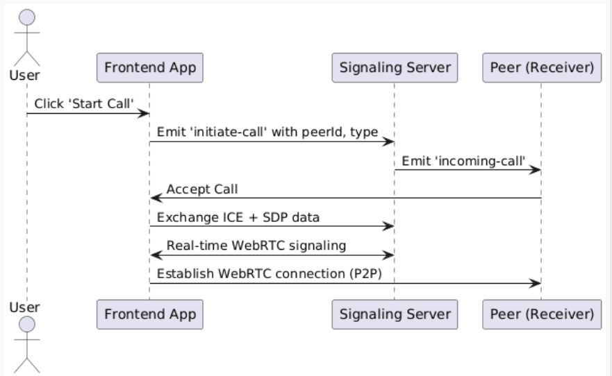

## Fundamental Use Cases:

| Category             | Feature                                                                       |
| -------------------- | ----------------------------------------------------------------------------- |
| **Authentication**   | Register, Login, Logout, JWT auth, OAuth (optional)                           |
| **Chat**             | One-on-one chat, group chat, message history, typing indicators, file sharing |
| **Audio Calling**    | One-on-one audio calls, group audio, mute/unmute                              |
| **Video Calling**    | One-on-one/group video calls, screen sharing, call end                        |
| **Games**            | Real-time multiplayer games (Tic-Tac-Toe, Chess, etc.)                        |
| **Presence**         | Online/offline status, last seen                                              |
| **Notifications**    | In-app + real-time push notifications (invite, new message, call)             |
| **User Profile**     | Avatar, username, settings, searchable directory                              |
| **Admin (Optional)** | Block users, remove messages, analytics                                       |

---

## Routes

### Frontend (React/Next.js + TS)

|Path|Purpose|
|---|---|
|`/login`|User login|
|`/register`|New user registration|
|`/profile`|View/edit profile|
|`/settings`|Preferences & security|
|`/chat`|Chat dashboard|
|`/chat/[roomId]`|Individual chat room|
|`/call`|Start/join video call|
|`/call/[callId]`|Video call room|
|`/audio`|Start/join audio call|
|`/audio/[callId]`|Audio call room|
|`/games`|Game hub|
|`/games/[gameType]`|Game menu (e.g. tictactoe, chess)|
|`/games/session/[gameId]`|Multiplayer game session|
|`/404`|Custom not-found|

### Backend (Node.js+Express+TS)

| Method | Endpoint                         | Purpose             |     |
| ------ | -------------------------------- | ------------------- | --- |
| `POST` | `/api/v1/auth/register`          | Register user       |     |
| `POST` | `/api/v1/auth/login`             | Login user          |     |
| `GET`  | `/api/v1/auth/me`                | Get user profile    |     |
| `GET`  | `/api/v1/chat/rooms`             | Get chat rooms      |     |
| `POST` | `/api/v1/chat/room`              | Create chat room    |     |
| `POST` | `/api/v1/chat/room/:id/message`  | Send message        |     |
| `GET`  | `/api/v1/chat/room/:id/messages` | Fetch messages      |     |
| `POST` | `/api/v1/call/new`               | Create video call   |     |
| `GET`  | `/api/v1/call/:id`               | Join video call     |     |
| `POST` | `/api/v1/audio/new`              | Create audio call   |     |
| `GET`  | `/api/v1/audio/:id`              | Join audio call     |     |
| `POST` | `/api/v1/games/:type/new`        | Create game session |     |
| `GET`  | `/api/v1/games/session/:id`      | Join/view game      |     |
| `POST` | `/api/v1/games/session/:id/move` | Send move           |     |
| `GET`  | `/api/v1/user/:id`               | View user           |     |
| `PUT`  | `/api/v1/user/:id`               | Update user         |     |

## Folder Structure

```
chat-app/
├── apps/
│   ├── web/                         # Next.js frontend (TS)
│   │   ├── pages/
│   │   │   ├── index.tsx            # Home / Dashboard
│   │   │   ├── login.tsx
│   │   │   ├── register.tsx
│   │   │   ├── chat/[roomId].tsx    # Chat room
│   │   │   ├── call/[callId].tsx    # Video call room
│   │   │   ├── audio/[callId].tsx   # Audio call room
│   │   │   ├── games/index.tsx      # Game lobby
│   │   │   ├── games/[game].tsx     # Game page
│   │   │   └── profile.tsx
│   │   ├── components/
│   │   │   ├── ChatBox.tsx
│   │   │   ├── VideoCall.tsx
│   │   │   ├── AudioCall.tsx
│   │   │   ├── GameBoard.tsx
│   │   │   └── UserCard.tsx
│   │   ├── hooks/
│   │   │   ├── useSocket.ts
│   │   │   └── useAuth.ts
│   │   ├── utils/
│   │   │   └── webrtc.ts
│   │   ├── store/
│   │   │   └── index.ts
│   │   └── tailwind.config.ts
│   └── api/                         # Node.js backend (Express/Fastify)
│       ├── src/
│       │   ├── controllers/
│       │   │   ├── auth.controller.ts
│       │   │   ├── chat.controller.ts
│       │   │   ├── call.controller.ts
│       │   │   ├── game.controller.ts
│       │   │   └── user.controller.ts
│       │   ├── routes/
│       │   │   ├── auth.routes.ts
│       │   │   ├── chat.routes.ts
│       │   │   ├── call.routes.ts
│       │   │   ├── game.routes.ts
│       │   │   └── user.routes.ts
│       │   ├── services/
│       │   │   ├── auth.service.ts
│       │   │   ├── chat.service.ts
│       │   │   ├── webrtc.service.ts
│       │   │   └── game.service.ts
│       │   ├── socket/
│       │   │   ├── index.ts
│       │   │   ├── chat.socket.ts
│       │   │   ├── call.socket.ts
│       │   │   └── game.socket.ts
│       │   └── index.ts             # Main server entrypoint
│       ├── prisma/
│       │   └── schema.prisma
│       ├── tsconfig.json
│       └── .env
├── packages/
│   ├── ui/                          # Component Library
│   │   ├── src/
│   │   │   ├── Button.tsx
│   │   │   ├── Avatar.tsx
│   │   │   └── Modal.tsx
│   │   └── index.ts
│   ├── config/                      # Shared configs
│   │   ├── eslint.config.js
│   │   ├── tailwind.config.ts
│   │   └── tsconfig.json
│   └── types/
│       └── index.d.ts               # Shared TypeScript types
├── docker/
│   └── docker-compose.yml
├── turbo.json
└── package.json
```


##  **WebSocket Events (Socket.io)**

### For Chat:

- `chat:joinRoom`
    
- `chat:newMessage`
    
- `chat:typing`
    
- `chat:seen`
    

### For Call:

- `call:offer`
    
- `call:answer`
    
- `call:candidate`
    
- `call:leave`
    
- `call:mute`
    
- `call:unmute`
    

### For Games:

- `game:join`
    
- `game:move`
    
- `game:restart`
    
- `game:end`

---
## ER-Diagram



## Class Diagram



## Sequence Diagram - User sends message in chat



## Sequence Diagram - Initiate Audio/Video Call


